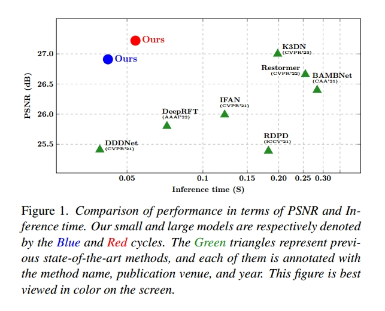
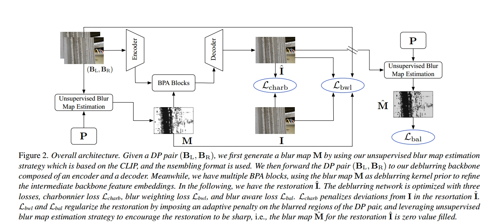

# LDP: Language-driven Dual-Pixel Image Defocus Deblurring Network

[This repository](https://github.com/noxsine/LDP) contains the PyTorch code for our paper "LDP: Language-driven Dual-Pixel Image Defocus Deblurring Network" by Hao Yang, Liyuan Pan, Yan Yang, Richard Hartley, and Miaomiao Liu.

> [paper]() | [arxiv](https://arxiv.org/abs/2307.09815)


## Introduction


Recovering sharp images from dual-pixel (DP) pairs
with disparity-dependent blur is a challenging task. Existing blur map-based deblurring methods have demonstrated
promising results. In this paper, we propose, to the best
of our knowledge, the first framework that introduces the
contrastive language-image pre-training framework (CLIP)
to accurately estimate the blur map from a DP pair unsupervisedly. To achieve this, we first carefully design text
prompts to enable CLIP to understand blur-related geometric prior knowledge from the DP pair. Then, we propose a format to input a stereo DP pair to CLIP without
any fine-tuning, despite the fact that CLIP is pre-trained on
monocular images. Given the estimated blur map, we introduce a blur-prior attention block, a blur-weighting loss, and
a blur-aware loss to recover the all-in-focus image. Our
method achieves state-of-the-art performance in extensive
experiments (see Fig. 1).


<div align=center>

</div>

## Framework

<div align=center>

</div>


## Run

Place the image in the input folder and run single_image.py for single image blur map estimation and dp_image.py for DP image blur map estimation. Deblurring are in the IR folder.


## Citation

```
@inproceedings{yang2024ldp,
  title={LDP: Language-driven Dual-Pixel Image Defocus Deblurring Network},
  author={Yang, Hao and Pan, Liyuan and Yang, Yan and Hartley, Richard and Liu, Miaomiao},
  booktitle={Proceedings of the IEEE/CVF Conference on Computer Vision and Pattern Recognition},
  pages={24078--24087},
  year={2024}
}
```

## Acknowledgement
The code is borrowed from the following repositories, thanks for sharing.
- [HINet](https://github.com/megvii-model/HINet)
- [Restormer](https://github.com/swz30/Restormer)
- [NAFNet](https://github.com/megvii-research/NAFNet)
- [CLIP](https://github.com/openai/CLIP)
- [DepthCLIP](https://github.com/openai/CLIP)


